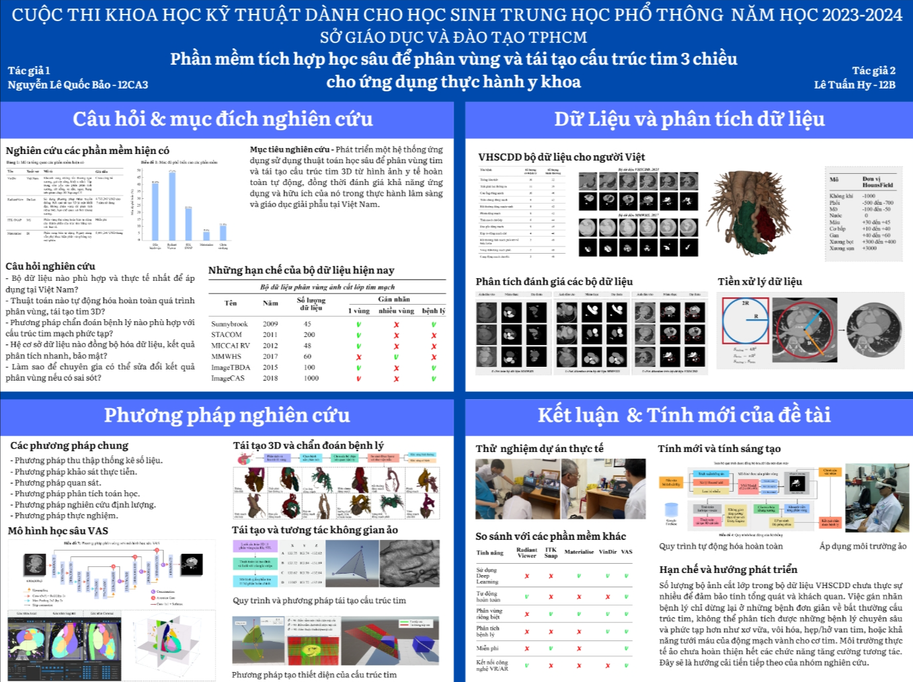

# VasculAR - Phần mềm tích hợp học sâu để phân vùng và tái tạo cấu trúc tim nguyên khối trong không gian 3D mô phỏng cho ứng dụng thực hành y khoa
Tên tiếng Anh: Integration of Deep Learning into automatic volumetric cardiovascular dissection and reconstruction in simulated 3D space for medical practice.

# 1. Tóm tắt (Abstract)
Phân tích hình ảnh tim mạch chính xác, hiệu quả rất cần thiết trong chẩn đoán và điều trị các bệnh lý tim mạch - nguyên nhân gây tử vong hàng đầu thế giới và Việt Nam. Tuy nhiên công việc này tốn nhiều thời gian, công sức, dễ sai sót; dữ liệu 2D gây khó khăn cho người phân tích vì sự phức tạp trong cấu trúc giải phẫu và sự đa dạng bệnh lý tim mạch. Vì vậy, nhóm đã nghiên cứu phát triển một hệ thống ứng dụng có tên VasculAR tích hợp thuật toán học sâu (Deep Learning) để tự động hóa việc phân vùng và tái tạo cấu trúc tim 3D từ bộ ảnh chụp cắt lớp y học; dự đoán 12 bệnh lý tim mạch tự động; kết nối cơ sở dữ liệu đám mây để lưu trữ, trao đổi thông tin phân tích; mô phỏng không gian thực tế ảo của phòng phẫu thuật. Nhóm đã thực hiện nghiên cứu bộ dữ liệu cắt lớp tim người và bộ ảnh cắt lớp thô của người Việt tại các bệnh viện Việt Nam để đảm bảo tính ứng dụng thực tiễn tại nước nhà; nghiên cứu 4 mô hình học sâu U-Net, ResNet, U-Net Attention, V-Net cho thuật phân vùng tự động; nghiên cứu quy trình chẩn đoán bệnh với phương pháp so khớp Dice Score; nghiên cứu thuật toán tái tạo 3D Marching Cubes và cải tiến thuật toán trở nên nhanh, chính xác và chi tiết; nghiên cứu mô phỏng không gian thực tế ảo để giúp chuyên gia tương tác cắt, mổ, xẻ trực tiếp mô hình tim 3D bằng lập trình Unity và kính VR. Kết quả bộ dữ liệu cho người Việt (VHSCDD) được ra đời. Thuật toán phân vùng tự động hóa hoàn toàn và thuật toán tái tạo tim 3D được các bác sĩ và chuyên gia khẳng định có thể giúp họ quan sát khuyết tật tim mạch dễ dàng hơn. Hệ thống phần mềm được thử nghiệm và đánh giá mang tính ứng dụng cao trong thực hành y khoa và giải phẫu học.

# Quá trình

