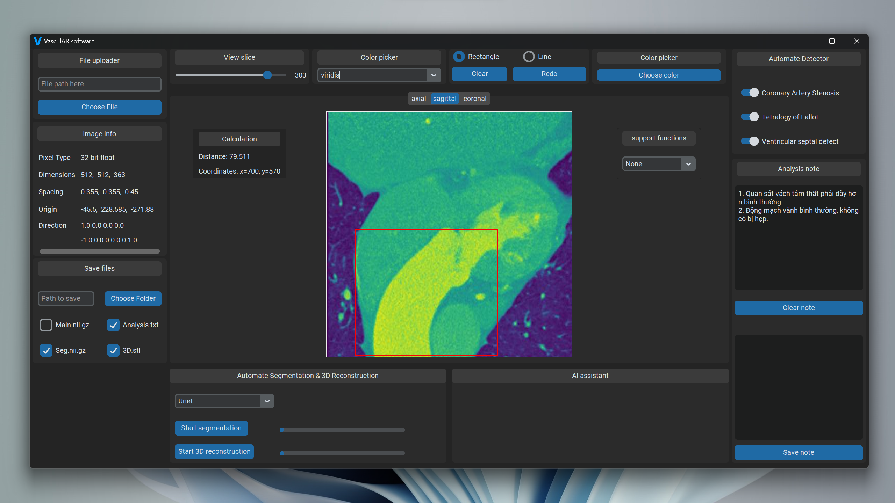
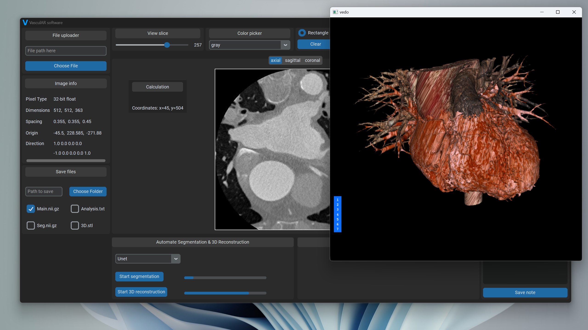
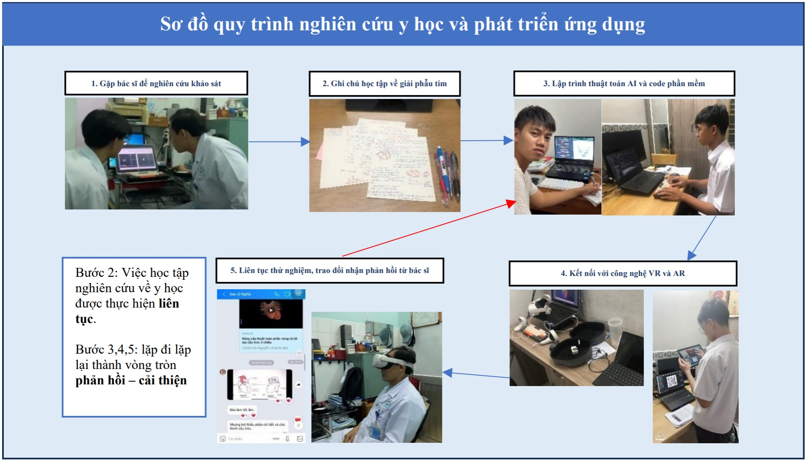

# VAS - Phần mềm tích hợp học sâu để phân vùng và tái tạo cấu trúc tim 3 chiều cho ứng dụng thực hành y khoa.

## Nâng cấp mới cho vòng thành phố

[Video demo mới nhất](https://youtu.be/ssdXmd1ua2c?si=EiynVL32P7t3Hdm3)
### Giao diện app mới với nhiều tính năng hỗ trợ
- Lý do: Qua quá trình nghiên cứu, khảo sát, xin phản hồi từ người dùng, nền tảng Web có nhược điểm sau:
    - Không đầy đủ công cụ cần thiết
    - Không đủ bảo mật vì hệ cơ sở dữ liệu dùng chung và xử lý dữ liệu không trên máy chủ
    - Không thân thiện với người dùng (2/3 bác sĩ, sinh viên thấy không quen khi thao tác trên web)
    - Website Js sử dụng thư viện papaya không thể nâng cấp và tích hợp thêm các tính năng khác như AI assistant hay khoanh vùng tổn thương tự động.

Và App giải quyết được các vấn đề trên:
Giao diện app được xây dựng bằng Python thuận lợi tích hợp Deep Learning.

### Nâng cấp thuật toán tái tạo cấu trúc tim 3D

[Link Video](https://youtu.be/_2katMerd64?si=ygL-vjjW1J7cRJSX)

## Poster & sơ đồ khối

## LỜI CẢM ƠN
- Cảm ơn Bác sĩ Nguyễn Văn Nghĩa (Trưởng khoa tim mạch Viện tim thành phố) đã chỉ dẫn những vấn đề quan trọng liên quan tới tim và ảnh chụp cắt lớp.
- Cảm ơn bác sĩ Lê Văn Phước (Trưởng khoa Chẩn đoán hình ảnh Bệnh viện Chợ Rẫy) đã thực hiện, tư vấn và hướng dẫn phân vùng trên bộ ảnh cắt lớp lòng ngực thô.  
- Cảm ơn bác sĩ Trần Văn Hữu (BS chuyên khoa 2, trưởng khoa ngoại tổng hợp bệnh viện Quận 1) đã tư vấn hướng phát triển và ứng dụng thực tế cho dự án.
- Cảm ơn bác sĩ Lê Thị Phương Nga BS khoa nội, bệnh viện Nguyễn Trãi, TPHCM đã hỗ trợ kiến thức về giãi phẫu lồng ngực, giãi phẫu tim người.
Cảm ơn anh Đoàn Văn Tuấn (cựu sinh viên trường Đại học Kỹ Thuật Y Tế Hải Dương, khoa chuẩn đoán hỉnh ảnh) đã giúp giới thiệu form khảo sát đến cho các bạn sinh viên khác.  
## TÓM TẮT
Tại Việt Nam, công tác chẩn đoán hình ảnh của kỹ thuật viên và bác sĩ chưa được tối ưu hóa một cách hiệu quả do sự lạc hậu về kỹ thuật và công nghệ đang sử dụng trong quy trình, đặc biệt đối với chuyên khoa tim mạch với các bệnh lý phức tạp, nguy hiểm. Để trợ giúp cho ngành y tế, nhóm đã phát triển một nền tảng công nghệ toàn diện có tên VasculAR giúp tăng tốc độ và độ chính xác cho phân tích ảnh cắt lớp vi tính, tăng tốc độ lưu chuyển hồ sơ bệnh án, và tăng tính trực quan tương tác trong công tác lập kế hoạch tiền phẫu thuật. Đề tài áp dụng quy trình thiết kế ứng dụng và quy trình nghiên cứu y học. Nhóm nghiên cứu về nguyên lý vật lý hạt nhân của các máy chụp MRI, CT cho việc cấu tạo ảnh. Các bệnh lý về tim được nghiên cứu gồm tứ chứng fallot, bệnh còn ống động mạch, và bất thường động mạch vành. Các mô hình học sâu (deep learning) đã được nghiên cứu bao gồm VGG, Resnet, Unet, Unet Attention và cho công việc phân vùng (segmentation) hình ảnh cắt lớp tim. Điểm mới của đề tài là sự tự động hóa trong các khâu từ tiền xử lý đến hậu xử lý nhờ áp dụng kiến thức toán học như phương trình tuyến tính, phương trình đường tròn và hình học không gian cho thuật toán tái tạo cấu trúc tim trong không gian 3 chiều. Kết quả nghiên cứu cho thấy công nghệ tăng cường thực tế (AR) được xác nhận giúp tăng tính tương tác trong các phiên họp tiền và hậu phẫu thuật. Mô Unet attention vượt xa kiến trúc truyền thống khác, đạt độ chính xác 0.9455 và kết quả Dice Coefficient đạt trung bình 0.91 trên bộ dữ liệu nghiên cứu. Trong quá trình thử nghiệm thực tế, kết quả phân tích từ kỹ thuật viên chẩn đoán hình ảnh được đưa về bác sĩ chẩn đoán lâm sàn hoặc các bệnh viện tuyến trên một cách nhanh chóng qua hệ cơ sở dữ liệu mã hóa đám mây PostgreSQL, giảm từ 20 phút còn 5 phút cho một ca.
Từ khóa: tim mạch. mô hình học sâu, phân vùng cắt lớp, tái tạo 3D

## MỞ ĐẦU
### 1. Lý do chọn đề tài
- Theo Tổ chức Y tế Thế giới, bệnh tim mạch là nguyên nhân gây tử vong hàng đầu trên toàn cầu (Mendis et al., 2011) [1]. Theo thống kê, Việt Nam có khoảng 200.000 người tử vong vì bệnh tim mạch. Số ca tử vong do các bệnh tim mạch cao hơn cả tử vong do ung thư, hen phế quản và đái tháo đường cộng lại [2]. Trong ca phẫu thuật tim, công tác chuẩn đoán hình ảnh đóng vai trò quan trọng trong việc lập kế hoạch tiền phẫu thuật. 
- Theo lời của Bác sĩ Nguyễn Văn Nghĩa, có nhiều trường hợp (xin phép không nêu tên) bệnh nhân chụp MRI lần 1 và 2 đều không phát hiện dấu hiệu bất thường, đến lần thứ 3 phải dùng kỹ thuật chụp MRI tim với độ nhạy cao (high-sensitivity cardiac MRI) mới phát hiện được bệnh lý thường bị bỏ sót trong chụp MRI thông thường do hình ảnh với những dấu hiệu không rõ ràng, mắt người khó nhận diện chính xác. Mỗi lần chụp MRI đều có thể để lại một nguy cơ, rủi ro cho bệnh nhân. Hay sự chậm trễ trong công tác quản lý lưu chuyển kết quả phân tích, hồ sơ bệnh án giữa các tuyến bệnh viện với nhau có thể khiến bệnh nhân chịu đau đớn, chậm trễ tiến trình điều trị [3]. Để hạn chế những bỏ sót, tăng tốc độ lưu chuyển thông tin, tối ưu hóa quy trình phân tích chẩn đoán, nhóm nghiên cứu đã chọn đề tài “Phần mềm tích hợp học sâu để phân vùng và tái tạo cấu trúc tim 3 chiều cho ứng dụng y học”.
### 2. Mục tiêu nghiên cứu
- Huấn luyện mô hình học sâu phân vùng tim cần đạt độ chính xác xấp xỉ 98-99%, chỉ số Dice Coeffient Score chỉ chấp nhận trên 0.9.
- Lập trình thuật toán tái tạo 3D cần vừa chính xác, nhanh, nhẹ, cho phép người dùng có thể tương tác dễ dàng bằng chuột hoặc trong không gian tăng cường thực tế ảo. Không gian 3D cần có chức năng hiển thị/ẩn từng vùng riêng biệt trong tim.
- Lập trình phần mềm đề cao tính tự động hóa.
- Lập trình kết nối cơ sở dữ liệu mã hóa đám mây có thể lưu trữ hình ảnh, khoanh vùng tổn thương, ghi chú phân tích của bác sĩ và kỹ thuật viên chẩn đoán.
### 3. Giả thuyết khoa học
- Nếu thực hiện nghiên cứu thành công, thì các chức năng, quy trình tự động hóa trong khâu tiền xử lý hình ảnh, khoanh vùng tổn thất sẽ tiết kiệm thời gian trong quá trình chẩn đoán. Hình ảnh tái tạo tim 3 chiều chính xác trong không gian AR tăng tính hình dung cho việc lập kế hoạch tiền phẫu thuật của bác sĩ phẫu thuật. Hệ cơ sở dữ liệu mã hóa bảo mật thông tin, quản lý dữ liệu bệnh nhân tạo thuận lợi cho quy trình phân tích hậu phẫu thuật trong các phiên họp.
### 4. Nhiệm vụ nghiên cứu
- Nghiên cứu về lý thuyết vật lý (từ trường, hạt nhân, sóng vô tuyến…) trong máy chụp MRI và CT để thông hiểu các thông số kỹ thuật và nguyên lý cấu tạo nên độ tương phản (đơn vị HounsField) của ảnh chụp cắt lớp.
- Nghiên cứu về các vùng trong cấu trúc tim và các bệnh lý liên quan đến tim.
- Nghiên cứu các mô hình học sâu tốt cho việc chuẩn đoán hình ảnh y học.
- Nghiên cứu thuật toán hình học không gian tái tạo cấu trúc tim 3 chiều.
- Nghiên cứu môi trường thực tế ảo (VR) và thực tế tăng cường (AR).
### 5. Câu hỏi nghiên cứu
C1: Làm sao để huấn luyện mô hình học sâu đạt kết quả tốt nhất.
C2: Làm sao để xây dựng một ứng dụng tự động hóa đầy đủ các tính năng, công cụ. 
C3: Làm sao để xây dựng một cơ sở dữ liệu an toàn, bảo mật, lưu trữ xử lý dữ liệu lớn.
### 6. Phương pháp nghiên cứu

### 7. Tính mới và tính sáng tạo của đề tài
- Nền tảng ứng dụng đầu tiên của người Việt sử dụng các mô hình học sâu ứng dụng cho 
nhiệm vụ phân tích chuyên sâu về ảnh cắt lớp tim mạch, phân vùng và tái tạo cấu trúc 
tim 3D một cách tự động hóa hoàn toàn.
- Cùng bác sĩ, chuyên gia chẩn đoán hinh ảnh tạo ra một bộ data mới với số vùng nhiều 
và chi tiết nhất hiện này (12 vùng), trên thế giới chỉ tối đa 7 vùng. [5]
- Kết nối công nghệ VR và AR vào trong ứng dụng y học